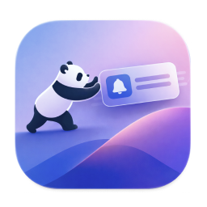

<p align="center">
  
</p>

<h1 align="center">syncfu</h1>

<p align="center">
  <strong>The notification layer your AI agents are missing.</strong>
</p>

<p align="center">
  <a href="https://github.com/Zackriya-Solutions/syncfu/releases"></a>
  <a href="https://github.com/Zackriya-Solutions/syncfu/blob/main/LICENSE"></a>
  <a href="https://github.com/Zackriya-Solutions/syncfu/actions"></a>
  
  
</p>

<p align="center">
  <a href="#install">Install</a> &middot;
  <a href="#quick-start">Quick Start</a> &middot;
  <a href="#api-reference">API</a> &middot;
  <a href="#use-cases">Use Cases</a> &middot;
  <a href="#integrations">Integrations</a> &middot;
  <a href="https://syncfu.dev">syncfu.dev</a>
</p>

---

syncfu is a standalone overlay notification system that sits between your background processes — AI agents, autonomous loops, skills, CI pipelines, cron jobs, anything — and you. It renders always-on-top native notifications that bypass the OS notification center, so nothing gets buried.

One command. One notification on your screen. That's it.

```bash
syncfu send "All 47 tests passing."
```

Need a decision from the user? Add `--wait` and the CLI blocks until they click.

```bash
syncfu send "Ship to production?" -t "Deploy?" \
  -a "yes:Yes" -a "no:No:danger" --wait
# stdout: "yes" or "no", exit 0. Dismissed = exit 1. Timeout = exit 2.
```

Need more? Add flags.

```bash
syncfu send -t "Loop complete" -p high -i circle-check \
  --action "open:Open PR:primary" --action "skip:Skip:secondary" \
  "All 47 tests passing."
```

<br />

### Highlights

| | Feature | Description |
|-|---------|-------------|
| 🔔 | **Always-on-top overlay** | NSPanel on macOS — non-activating, click-through, joins all Spaces |
| ⏳ | **`--wait` flag** | CLI blocks until the user clicks an action button (SSE-backed) |
| 🎨 | **27 style properties** | Full visual control per notification — colors, fonts, borders, radii |
| 🖥️ | **Multi-monitor** | Notifications follow your mouse cursor across displays |
| 🔗 | **Webhook callbacks** | Action buttons POST to your `callbackUrl` for closed-loop automation |
| 📊 | **Live progress bars** | Update in-flight notifications with progress, body changes, new actions |
| 🧪 | **181 tests** | 72 frontend + 70 Rust server + 29 CLI unit + 10 CLI integration |
| ⚡ | **Zero config** | No config files — everything is API-driven per notification |

<br />

Built with **Tauri v2** + **Rust** (axum) + **React** (Zustand). Ships on macOS, Windows, and Linux.

---

## Table of Contents

- [Why this exists](#why-this-exists)
- [How it works](#how-it-works)
- [Install](#install)
- [Quick start](#quick-start)
- [Use cases](#use-cases)
- [System tray](#system-tray)
- [API reference](#api-reference)
- [Integrations](#integrations)
- [Architecture](#architecture)
- [Customization](#customization)
- [Roadmap](#roadmap)
- [Contributing](#contributing)
- [License](#license)

---

## Why this exists

If you run AI agents, autonomous coding loops, or long-running background tasks — you already know the problem. The work finishes, but you don't notice. The agent wrote 14 files, ran the tests, opened a PR... and you're on Twitter. Or the build broke 20 minutes ago and you've been waiting on nothing.

OS notifications are unreliable for this. They get swallowed by Focus Mode, grouped into oblivion, or silently dropped. You need a notification layer that respects your attention — one that puts information on your screen when it matters, with action buttons so you can respond without context-switching.

syncfu is that layer.

---

## How it works

syncfu runs as a **system tray app** with two faces:

1. **Overlay** — an invisible, always-on-top layer across your screen. When a notification arrives via HTTP, it slides in from the top-right with action buttons, progress bars, and custom styling. Clicks pass through to your apps underneath. Only the notification cards are interactive. Follows your mouse cursor across monitors.

2. **System tray** — syncfu lives in your menu bar / system tray. Open the main window to see active notifications, or quit from the tray menu.

```
Your App ──HTTP POST──▸ syncfu server ──▸ Overlay Notification
CLI      ──HTTP POST──▸ syncfu server ──▸ Overlay Notification
CLI (--wait) ─────────▸ SSE stream ◂──── wait for action/dismiss
```

| Protocol | Port | Purpose |
|----------|------|---------|
| HTTP REST | `9868` | Send, update, dismiss, wait (SSE) |

---

## Install

### One-liner (recommended)

**macOS / Linux:**
```bash
curl -fsSL https://raw.githubusercontent.com/Zackriya-Solutions/syncfu/main/install.sh | sh
```

**Windows (PowerShell):**
```powershell
irm https://raw.githubusercontent.com/Zackriya-Solutions/syncfu/main/install.ps1 | iex
```

**Specific version:**
```bash
curl -fsSL https://raw.githubusercontent.com/Zackriya-Solutions/syncfu/main/install.sh | sh -s -- --version=X.Y.Z
```

> SHA-256 checksum verification is enforced by default. Use `--skip-checksum` to bypass.

### From source (CLI only)
```bash
git clone https://github.com/Zackriya-Solutions/syncfu.git
cd syncfu
cargo install --path cli
```

### Desktop app (from source)
```bash
git clone https://github.com/Zackriya-Solutions/syncfu.git
cd syncfu
pnpm install
pnpm tauri build
```

> **Prerequisites:** [Rust](https://rustup.rs/), [Node.js](https://nodejs.org/) 18+, [pnpm](https://pnpm.io/), and [Tauri v2 prerequisites](https://v2.tauri.app/start/prerequisites/).

See [CHEATSHEET.md](CHEATSHEET.md) for a quick-reference of all CLI commands and flags.

---

## Quick start

```bash
# Send your first notification — just a message
syncfu send "Hello from syncfu!"

# With a title and priority
syncfu send -t "Build Complete" -p high "All 142 tests passing"

# With action buttons
syncfu send -t "PR #42" \
  --action "approve:Approve:primary" \
  --action "skip:Skip:secondary" \
  "Review requested"

# Block until the user responds (--wait)
ACTION=$(syncfu send -t "Approve?" \
  -a "yes:Yes" -a "no:No:danger" --wait "Merge PR #42?")
echo "User chose: $ACTION"  # "yes", "no", "dismissed", or "timeout"

# Or use curl directly
curl -X POST localhost:9868/notify \
  -H "Content-Type: application/json" \
  -d '{"sender":"test","title":"It works","body":"Your first notification"}'

# List active notifications
syncfu list | jq '.[].title'

# Check server health
syncfu health
```

### Always running

syncfu is designed to stay alive in the background — your agents depend on it.

- **Starts at login** (configurable) — silently, tray + overlay only
- **Closing the window** hides it to the tray — doesn't quit
- **Ctrl+Q / Cmd+Q** asks: *"Quit syncfu? Agents won't be able to notify you."*
- **Tray → Quit** also confirms before exiting
- You'll never accidentally kill it

---

## Use cases

<details>
<summary><strong>AI agents & autonomous loops</strong></summary>

#### Claude Code skills and hooks

Your `/remind` skill fires a cron, but the alert is just a terminal bell you'll never hear. Wire it to syncfu and get an overlay notification with action buttons — snooze, mark done, or open the file.

```bash
# Inside any Claude Code skill or hook
syncfu send -t "$TITLE" -s remind --sound default \
  --action "done:Done:primary" --action "snooze:Snooze 15m:secondary" \
  "$BODY"
```

#### Autonomous coding loops

Running `/loop` or a multi-agent workflow that takes 30 minutes? Get notified when each phase completes, when tests fail, or when the loop needs human input.

```bash
syncfu send -t "Phase 3/5 complete" -s loop-operator \
  --progress 0.6 --progress-label "3 of 5" \
  "Integration tests: 42 passed, 0 failed. Starting E2E phase..."
```

#### Agent decision gates

An agent needs human approval before a destructive action. Use `--wait` to block the agent until the user responds via the overlay notification.

```bash
syncfu send -t "Confirm" -s agent -p high \
  -a "yes:Proceed" -a "no:Cancel:danger" \
  --wait --wait-timeout 120 \
  "Delete 47 stale branches?" && git branch -d $(git branch --merged)
```

#### More ideas
- **Agent handoff alerts** — notify the human between agent stages for review
- **Stalled loop detection** — watchdog pings syncfu if no progress in N minutes
- **Multi-agent dashboards** — each agent reports with its own sender ID, stacked as a live progress board

</details>

<details>
<summary><strong>CI/CD & DevOps</strong></summary>

```bash
syncfu send -t "Build passed" -s github-actions -i circle-check \
  --action "open_pr:Open PR:primary" --sound success --group ci-builds \
  "main built in 3m 42s — 142 tests passed, coverage 87% (+2.1%)"
```

- **Deploy progress** — track multi-stage deployments with live progress bars
- **Infrastructure alerts** — disk full, memory pressure, certificate expiring
- **Database migrations** — *"Migrating users table — 2.4M of 8.1M rows (30%)"*

</details>

<details>
<summary><strong>Development workflow</strong></summary>

```bash
# Notify on test pass or fail
cargo test && syncfu send -t "Tests passed" -p low -i circle-check "All green" \
  || syncfu send -t "Tests failed" -p critical -i circle-x "Check terminal"
```

- **Long compilation finished** — Rust full rebuild, C++ linking, Go generate
- **PR review requested** — webhook listener with "Review" and "Skip" buttons
- **Merge conflict alerts** — detect before you waste time on a broken base
- **Lint / type-check results** — background `eslint` or `tsc --noEmit`

</details>

<details>
<summary><strong>Personal productivity & ADHD support</strong></summary>

```bash
syncfu send -t "Stand-up in 5 minutes" -p high --sound default --timeout 300 \
  "Prepare: yesterday's PR review, today's auth refactor"
```

- **Reminders that actually reach you** — overlay ON YOUR SCREEN, not a badge on an app you don't check
- **Time-boxed focus sessions** — pomodoro with live progress bar
- **Context switching prompts** — *"You've been on this bug for 45 minutes..."*
- **Medication reminders** — critical-priority, no auto-dismiss, `--wait` confirms you took it

```bash
syncfu send -t "Medication" -p critical -i pill --timeout never \
  -a "taken:Taken" -a "skip:Skip:danger" \
  --wait "Time to take your medication"
```

</details>

<details>
<summary><strong>Server & infrastructure monitoring</strong></summary>

- **Health check dashboard** — poll services every 60s, stacked notification group
- **SSL certificate expiry** — with a "Renew" action button
- **Disk space warnings** — *"/dev/sda1 is 92% full — 14GB remaining"*
- **Container restart loops** — critical priority alerts
- **Cron job completion** — nightly backup, database vacuum, log rotation

</details>

<details>
<summary><strong>Data & ML pipelines</strong></summary>

```bash
syncfu send -t "Epoch 45/100" -s training --progress 0.45 --group training-run-7 \
  "Loss: 0.0234 (↓12%) — Val accuracy: 94.2% — ETA: 2h 15m"
```

- **Data pipeline stages** — extract → transform → load, with failure alerts
- **Model evaluation** — *"Model v2.3: accuracy 94.2% (+1.8%)"* with Deploy/Reject buttons
- **Dataset processing** — progress bar that updates every 1000 records

</details>

<details>
<summary><strong>Team, home automation & more</strong></summary>

- **Slack/Discord highlights** — forward @mentions as overlay notifications
- **Email triage** — urgent emails surface as notifications with "Open" and "Snooze" actions
- **Smart home events** — Home Assistant, Node-RED, IoT webhooks
- **Price alerts** — stock/crypto threshold notifications
- **Billing warnings** — *"AWS spend: $847 (85% of $1000 budget)"*
- **Render complete** — video, 3D scene, image batch notifications

</details>

---

## System tray

syncfu lives in your system tray (menu bar on macOS). From the tray you can:

- **Open** the main window to see active notifications
- **Clear all** notifications
- **Quit** syncfu (with confirmation)

Closing the main window hides it — syncfu keeps running in the tray. The overlay stays active.

---

## API reference

### HTTP endpoints

| Method | Path | Description |
|--------|------|-------------|
| `POST` | `/notify` | Send a notification |
| `POST` | `/notify/{id}/update` | Update an existing notification (progress, body) |
| `POST` | `/notify/{id}/action` | Trigger an action (fires webhook, dismisses) |
| `POST` | `/notify/{id}/dismiss` | Dismiss a specific notification |
| `GET` | `/notify/{id}/wait` | SSE stream — blocks until action/dismiss |
| `POST` | `/dismiss-all` | Dismiss all active notifications |
| `GET` | `/health` | Server status + active notification count |
| `GET` | `/active` | List all active notifications (JSON) |

### Notification payload

```json
{
  "sender": "my-app",
  "title": "Build Complete",
  "body": "**main** built in 3m 42s\n- 142 tests passed",
  "icon": "circle-check",
  "priority": "normal",
  "timeout": { "seconds": 15 },
  "actions": [
    { "id": "open", "label": "Open PR", "style": "primary" },
    { "id": "dismiss", "label": "Dismiss", "style": "secondary" }
  ],
  "progress": { "value": 0.75, "label": "3 of 4", "style": "bar" },
  "group": "ci-builds",
  "theme": "github-dark",
  "sound": "success",
  "callback_url": "http://localhost:8080/callback"
}
```

<details>
<summary><strong>Full field reference</strong></summary>

| Field | Type | Required | Description |
|-------|------|----------|-------------|
| `sender` | string | yes | Identifier for the sending process |
| `title` | string | yes | Notification title |
| `body` | string | yes | Body text (plain text) |
| `icon` | string | no | Lucide icon name (e.g. `phone`, `git-pull-request`, `bell`) |
| `font` | string | no | Google Font name (e.g. `Space Grotesk`, `JetBrains Mono`) |
| `priority` | string | no | `low`, `normal` (default), `high`, `critical` |
| `timeout` | object | no | `{"seconds": N}` or `"never"` or `"default"` (auto by priority) |
| `actions` | array | no | Up to 3 action buttons |
| `progress` | object | no | Progress bar (`bar` or `ring` style) |
| `group` | string | no | Group key (tracked, grouping UI planned) |
| `theme` | string | no | `light` or `dark` (auto-follows system by default) |
| `sound` | string | no | Sound name (accepted, playback planned) |
| `callback_url` | string | no | URL to POST when an action is clicked |
| `style` | object | no | Per-notification style overrides (see below) |

</details>

<details>
<summary><strong>Style overrides (27 properties)</strong></summary>

Override any visual property per notification:

```json
{
  "style": {
    "accentColor": "#22c55e",
    "cardBg": "rgba(10, 40, 20, 0.96)",
    "iconColor": "#4ade80",
    "iconBg": "rgba(34, 197, 94, 0.15)",
    "titleColor": "#bbf7d0",
    "bodyColor": "#86efac",
    "senderColor": "#67e8f9",
    "btnBg": "#7c3aed",
    "btnColor": "#ffffff",
    "btn2Color": "#c084fc",
    "dangerBg": "#dc2626",
    "progressColor": "#22c55e",
    "countdownColor": "#ef4444"
  }
}
```

Full list: `accentColor`, `cardBg`, `cardBorderRadius`, `iconColor`, `iconBg`, `iconBorderColor`, `titleColor`, `titleFontSize`, `bodyColor`, `bodyFontSize`, `senderColor`, `timeColor`, `btnBg`, `btnColor`, `btnBorderColor`, `btn2Bg`, `btn2Color`, `btn2BorderColor`, `dangerBg`, `dangerColor`, `dangerBorderColor`, `progressColor`, `progressTrackColor`, `countdownColor`, `closeBg`, `closeColor`, `closeBorderColor`.

</details>

<details>
<summary><strong>Per-action button styling</strong></summary>

Each action button can override its own colors:

```json
{
  "actions": [
    {
      "id": "deploy",
      "label": "Deploy",
      "style": "primary",
      "icon": "rocket",
      "bg": "#22c55e",
      "color": "#ffffff",
      "borderColor": "#16a34a"
    }
  ]
}
```

</details>

---

## Integrations

### Claude Code hooks

Get notified on every agent completion:

```json
{
  "hooks": {
    "Stop": [{
      "command": "syncfu send -t 'Agent done' \"$(git diff --stat HEAD~1 2>/dev/null || echo 'No changes')\""
    }]
  }
}
```

### GitHub Actions

```yaml
- name: Notify syncfu
  if: always()
  run: |
    syncfu send -t "${{ github.workflow }} — ${{ job.status }}" \
      -s github-actions \
      -p ${{ job.status == 'success' && 'normal' || 'critical' }} \
      "${{ github.repository }}@${{ github.ref_name }}"
  env:
    SYNCFU_SERVER: http://your-machine:9868
```

### Shell aliases

```bash
# Add to .zshrc / .bashrc
alias notify='syncfu send -t'
alias notify-done='syncfu send -t "Done"'
alias notify-fail='syncfu send -t "Failed" -p critical --sound error'

# Usage
long-running-command; notify-done "Finished long-running-command"
```

### Node.js / Python / Any language

```javascript
// Node.js
await fetch('http://localhost:9868/notify', {
  method: 'POST',
  headers: { 'Content-Type': 'application/json' },
  body: JSON.stringify({ sender: 'my-app', title: 'Done', body: 'Task complete' })
});
```

```python
# Python
import requests
requests.post('http://localhost:9868/notify', json={
    'sender': 'my-app', 'title': 'Done', 'body': 'Task complete'
})
```

---

## Architecture

```
                           ┌──────────────────────────────────┐
                           │          syncfu (Tauri v2)        │
                           │                                   │
 HTTP POST :9868 ─────────▸│  axum server ──▸ Notification     │
                           │       │          Manager          │──emit──▸ React Overlay
 CLI (fire & forget) ─────▸│       │          (Arc shared)     │         (follows cursor monitor)
                           │       │              │            │
 CLI (--wait) ─────────────▸│  SSE stream ◂── Waiter Registry │
                           │       │         (broadcast ch)    │
                           │       │              │            │
                           │       │         ┌────┴────┐       │
                           │       │         │ Tray    │       │
                           │       │         │ Webhook │       │
                           │       │         └─────────┘       │
                           └──────────────────────────────────┘
```

| Component | Stack |
|-----------|-------|
| Backend | Rust — axum HTTP server, SSE streams, tokio broadcast channels |
| Frontend | React — Zustand store, CSS animations, Lucide icons, Google Fonts |
| Overlay | NSPanel (macOS) — non-activating, follows mouse cursor across monitors |
| CLI | Rust — fire-and-forget by default, `--wait` opens SSE stream |
| System tray | Tauri tray API — pause, clear, quit with confirmation |

---

## Customization

syncfu doesn't use config files — everything is controlled per-notification via the API.

**Per-notification styling** — override any of 27 CSS properties:
```bash
syncfu send -t "Custom" --style-json '{"accentColor":"#22c55e","cardBg":"rgba(10,40,20,0.96)"}' "Styled notification"
```

**Google Fonts** — load any Google Font on demand:
```bash
syncfu send -t "Fancy" --font "Space Grotesk" "With a custom font"
```

**Light/dark theme** — auto-follows system by default, or set per-notification with `"theme": "dark"`.

---

## Roadmap

### Shipped

- [x] Core overlay window + system tray
- [x] NSPanel on macOS (non-activating, joins all Spaces)
- [x] Liquid Glass design + slide-in/out animations
- [x] HTTP REST server (port 9868)
- [x] Light/dark theme (auto + per-notification override)
- [x] Lucide icons + Google Fonts (programmable per notification)
- [x] Auto-dismiss with countdown bar (pauses on hover)
- [x] Critical pulsing glow (Siri-style)
- [x] Webhook callbacks (action buttons POST to `callbackUrl`)
- [x] 27 per-notification style properties + per-action button styling
- [x] CLI (`syncfu send/dismiss/list/health`) + `--wait` flag (SSE)
- [x] Multi-monitor support (follows mouse cursor)
- [x] Click-through overlay (only cards interactive)
- [x] One-command install (`curl | sh` + PowerShell)
- [x] 181 tests (72 frontend + 70 server + 29 CLI unit + 10 CLI integration)

### Planned

- [ ] Markdown body rendering
- [ ] Sound playback
- [ ] Notification grouping UI
- [ ] Persistent history (SQLite)
- [ ] Linux Wayland support
- [ ] Configuration file
- [ ] Encrypted transport (mTLS / API keys)
- [ ] Remote notifications (tunnel / cloud relay)

---

## Contributing

syncfu is open source under the MIT license. Contributions welcome.

```bash
git clone https://github.com/Zackriya-Solutions/syncfu.git
cd syncfu
pnpm install
pnpm tauri dev
```

**Prerequisites:** Rust 1.75+, Node.js 18+, pnpm, [Tauri v2 prerequisites](https://v2.tauri.app/start/prerequisites/)

---

## License

MIT &copy; [Zackriya Solutions](https://github.com/Zackriya-Solutions)

---

<p align="center">
  <a href="https://syncfu.dev"><strong>syncfu.dev</strong></a> — because your agents shouldn't have to wait for you to check the terminal.
</p>
